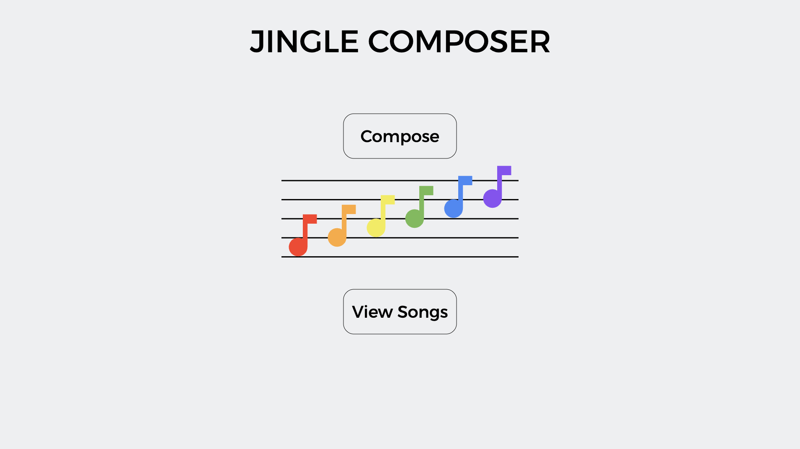
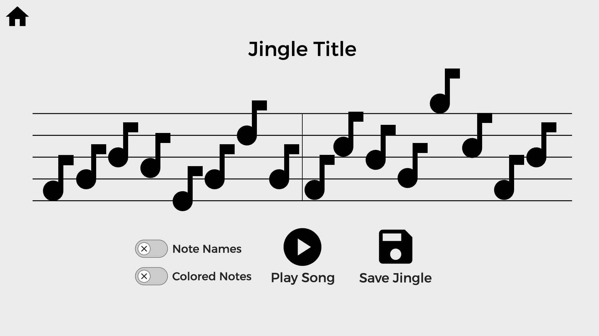
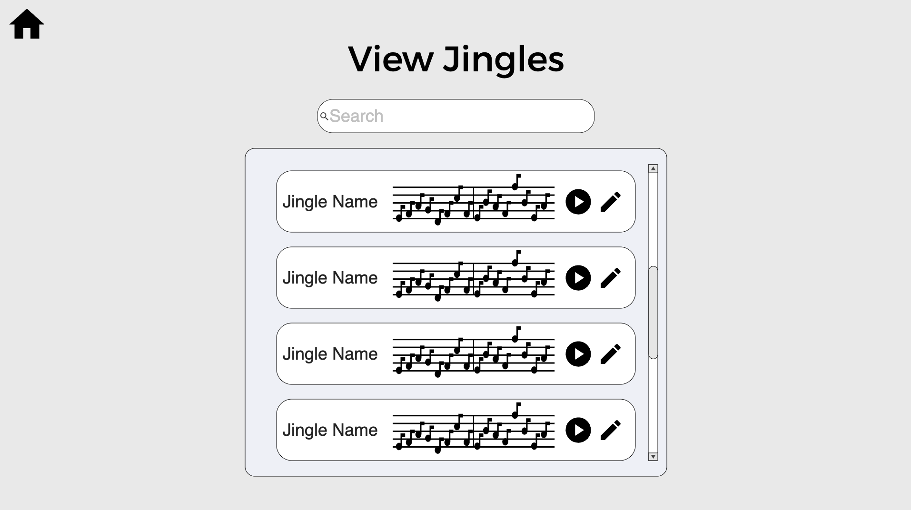

# Jingle Composer
Author: Austin Hunt

## Project Specifications 

### Overview
Jingle Composer is a lightweight music composition website that allows users to create short jingles with an interactive and simple
interface. The interface will be a couple of bars of blank sheet music, and the user will be able to click on a note line or space on
the bars to place a note there. If you have ever played the Animal Crossing games, this will be similar to composing your town song;
that is where I got the inspiration for this project from.

Users will be able to choose from a list of different sounds for their song, and be able to save songs that they have created. There will 
be a page where the user can search for and view previous songs that they have created. There, they can open the a song and edit it if they
desire. When a user saves a song, they can name it and the website will store data about when the song was created in addition to the song.

### Target Audience
The target audience for this website is primarily musicians, but the website's design is intended to be simple and approachable, so those
with little to no musical knowledge can play around and have fun with it. The website is intended to be more of a fun game than a serious
composition tool.

### Data Management
This site will manage the data for the songs created. I'll have to design a model for storing the song data, such as which notes appear in
the song, what order they appear in the song, note duration, which instrument sound is being used, etc. For each song, the time the song was
created, last edited, and the song's name will also need to be stored. As I'll mention in the stretch goals, managing user data would also 
be necessary for authentication.

### Main challenges
There are a couple key things that I anticipate being most challenging for this project. The first is figuring out how to create the
interactive interface for composing the songs. My current thought is to use a grid of buttons that represent the pitch on the y axis
and the rhythm on the x axis, and then overlay that on an image of the sheet music, with the buttons changing the location of note images
when you click them. The other main challenge is linking this interface to the data of the song, to be able to save the song. I'm thinking
that I could simply use an array, with each index representing a new note in the bar and each index storing a pitch for that note's position.
It may be better to use a more robust data structure, so I'll have to look into that.

### Stretch goals

* User authentication: The primary stretch goal would be to include a way to create an account so that users could save songs, and login
on different devices and see their songs, and this ties into another stretch goal
* Custom Sounds: Allowing users to upload small sound bytes to be used for their songs would be a fun feature, but I'm not sure I would be
able to figure out how to do that in the time frame of this project
* Social aspect: A big stretch goal, and one that is almost certainly out of the scope of this project, is to make a social aspect to this
site where users could share their songs and other could see them, and could maybe comment and like them. This is a fun idea, but would more
be something that I would try to implement after the class was over

## Mockups

Landing Page:

Compose Page:

View Page:

